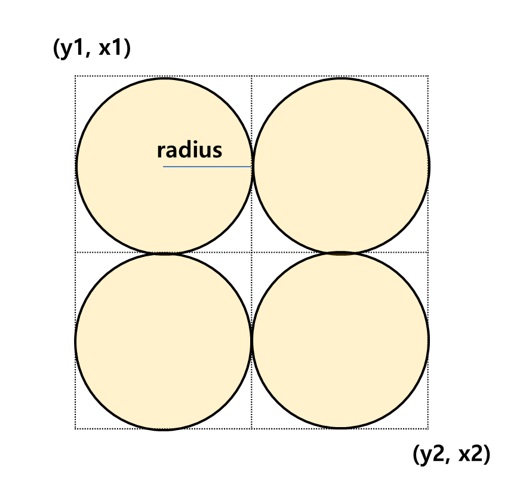

# global-matzip
- 이 파이썬 스크립트는 `Google Map API`의 `PlacesAPI`를 이용해 특정 지역의 식당 정보를 수집합니다. 
- 가져온 정보는 <현재날짜 + 시간(분초)>-<도시이름>-<랜덤 UUID> 디렉토리 아래에 생성됩니다.
- 각 파일의 한 줄은 <식당명>/<주소>/<평점> 입니다.

### Run
```shell
$ python google_information_getter.py <config_file_path>
```

### Caution
- 구글 지도 API의 Nearby Search를 사용합니다.
- 이 요청은 23년 8월 기준 32불 / 1,000회의 비용이 청구됩니다.
- 무료 체험 계정일 경우 200불의 크레딧이 주어진다고 합니다.
- https://developers.google.com/maps/billing/gmp-billing?hl=ko
- nearbySeach api billing : 32$ / 1000


### 구역 검색 방법 방법
- 입력된 (위도, 경도)는 다음과 같이 사용됩니다.
- 1. 위도 / 경도를 Radius를 기준으로 잘라서 각 블록을 생성함. 
- 2. (좌 -> 우)로 이동 후, 아래로 이동해서 (좌 -> 우)로 이동함. (0,0) -> (0,1) -> (1,0) -> (1,1) 순으로 이동
- 각 블록의 중심에서 radius를 기준으로 검색합니다. 따라서 겹치지 않는 부분이 발생하는데, 이 부분은 Diameter를 조절해서 중복 검색으로 정확성을 올릴 수 있습니다. 
         



### Config 파일
- `diameter` : 구역을 나눌 직경. 
- `city` : 검색할 도시. position_constant에 있는 값입니다. 
- `find_type` : 검색할 타입. 
- `is_async` : False / True. Async로 할 경우, 이벤트 루프에서 멀티 프로세싱 처리되어 좀 더 빠른 결과를 기대할 수 있습니다. 
```yaml
google:
  api_key: <YOUR_API_KEY>
search:
  diameter: 25000
  city:
    - BALI
    - HANOI
  find_type: restaurant
is_async: False

```

### 도시 추가하는 방법
- `git clone` 후, `position_constant.py` 파일에 양식에 맞게 도시 + 좌표를 추가하세요.
- Config 파일에 값을 설정한 후, 파이썬 스크립트를 실행시켜주세요.

